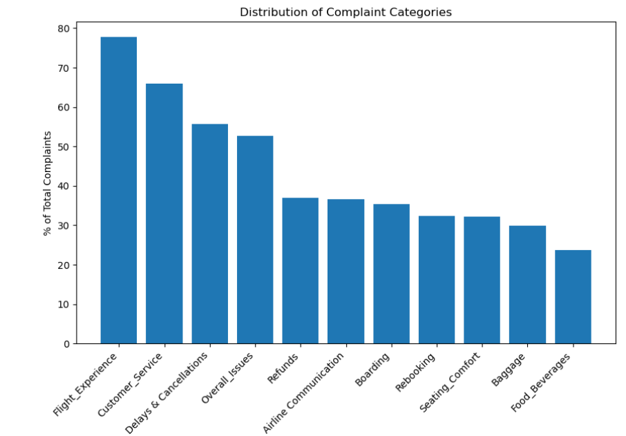
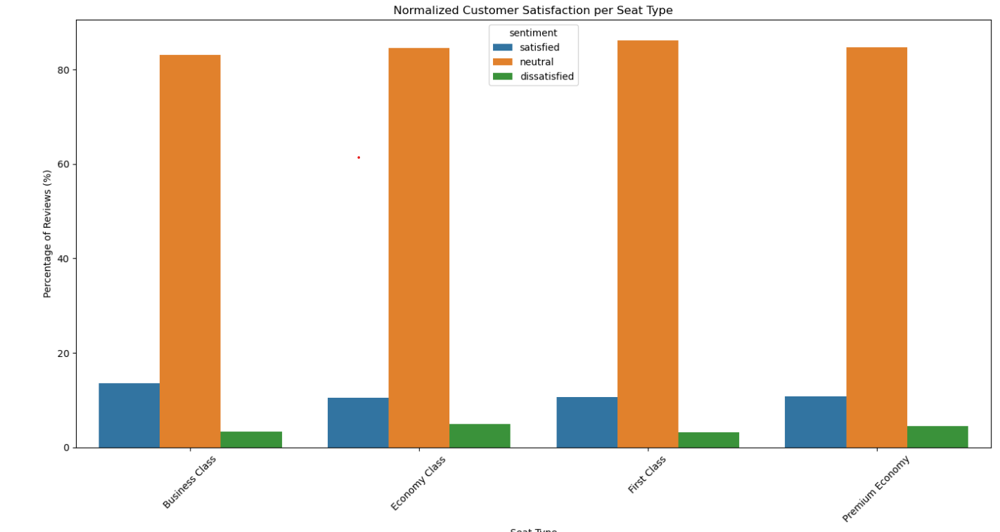
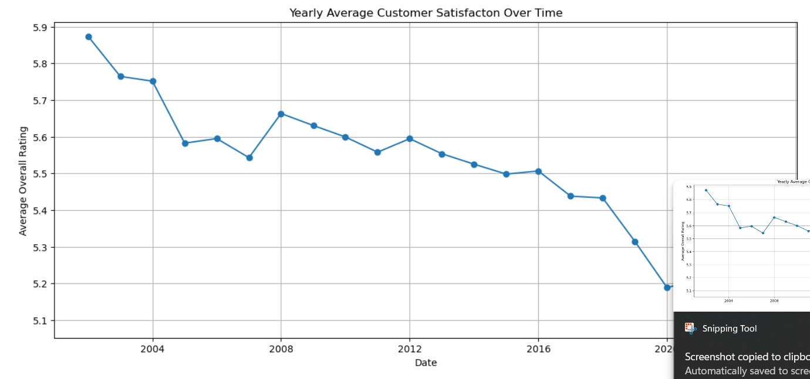

# Airline Review Sentiment Analysis with MongoDB

## Overview
This project analyzes airline customer reviews using MongoDB, Python, and natural language processing techniques. The goal was to store and process unstructured review data, calculate customer sentiment, identify common complaint themes, and visualize satisfaction patterns across airlines, seat types, and time.

The dataset contained 23,171 airline reviews from 497 airlines. The project used MongoDB to store review text, metadata, sentiment scores, and complaint categories.

## Business Problem
Airlines receive large amounts of unstructured customer feedback through online reviews. This project explores how database systems and text analysis can be used to organize review data and identify common sources of dissatisfaction.

## Tools Used
- Python
- MongoDB Atlas
- PyMongo
- Pandas
- NLTK
- TextBlob
- Matplotlib
- Plotly

## Skills Demonstrated
- NoSQL database design
- MongoDB data ingestion
- Python data cleaning
- Natural language processing
- Sentiment analysis
- Data visualization
- Exploratory data analysis
- Query performance testing
  
## Project Workflow
1. Loaded airline review CSV data into MongoDB.
2. Created separate MongoDB collections for review text and metadata.
3. Cleaned review text by lowercasing, removing punctuation, handling contractions, removing stopwords, and lemmatizing words.
4. Used TextBlob to calculate sentiment scores for each review.
5. Filtered negative reviews and categorized complaints using keyword matching.
6. Visualized complaint categories, airline-level complaint patterns, seat-type satisfaction, and sentiment trends over time.

## Key Results
- Identified 11 major complaint categories, including flight experience, customer service, delays and cancellations, baggage, boarding, refunds, and seat comfort.
- Found that flight experience and customer service were among the most common complaint themes.
- Compared sentiment scores with original customer ratings using Pearson correlation.
- Observed a general downward trend in average customer sentiment over time.
- Found that TextBlob often produced neutral/mid-range sentiment scores, suggesting that more advanced NLP models could improve future analysis.

## Visualizations

